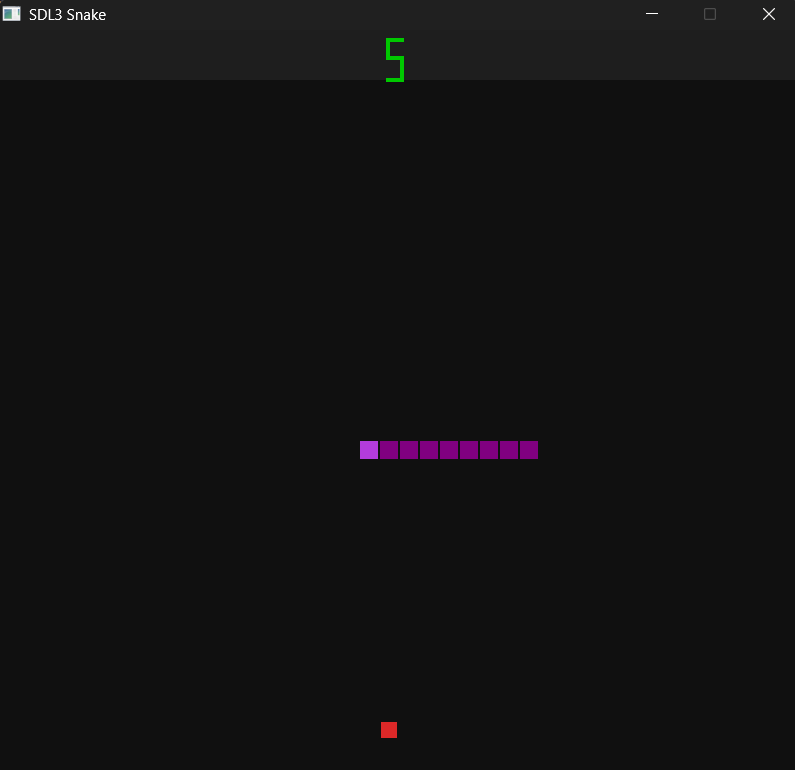

#  Classic Snake Game (Nokia Style) – C & SDL3

A nostalgic Snake game built in **C using SDL3**, inspired by the classic version found on old Nokia phones.  
Simple graphics, smooth movement, and old-school fun!

---

##  Game Preview
 


---

##  Features

- Classic Nokia-style gameplay  
- Smooth snake movement using SDL3  
- Score tracking  
- Collision detection (walls & self)  
- Simple and lightweight C implementation  
- Cross-platform (Windows / Linux / macOS)

---

##  Technologies Used

- **C Programming Language**
- **SDL3 (Simple DirectMedia Layer)**
- GCC / MinGW / Clang

---

###  Prerequisites

Make sure you have the following installed:

- **SDL3**
- **C Compiler** (GCC / MinGW / Clang)

---

###  Clone the Repository

```bash
git clone https://github.com/yourusername/snake-sdl3.git
cd snake-sdl3
